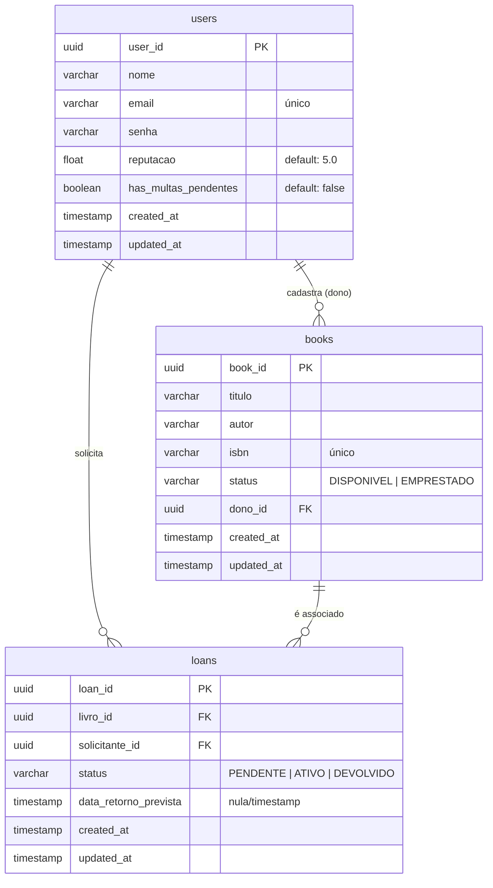

# 📚 BOOKSHARE

Plataforma de compartilhamento de livros físicos entre usuários, promovendo acesso ao conhecimento, redução de custos e controle de reputação no ecossistema de empréstimos.

---

<div align="left">
  
  
  
  
  
</div>

---

## 🎯 Objetivo

Facilitar o compartilhamento de livros físicos de forma segura e controlada entre usuários, através de regras estritas de elegibilidade, cálculo automático de penalidades por atraso na devolução e um sistema de reputação dinâmico.

---

## 🚀 Funcionalidades

* **Cadastro de usuários**: Identificação e autenticação.
* **Autenticação**: Acesso seguro via Bearer Token (JWT).
* **Cadastro de livros**: Inclusão de novos exemplares com ISBN e status inicial.
* **Busca de livros**: Localização de títulos disponíveis para empréstimo.
* **Solicitação de empréstimos**: Reserva de exemplares elegíveis.
* **Aprovação de empréstimos**: Aceite formal do proprietário do livro.
* **Registro de devolução com atrasos**: Devolução do livro com cálculo de multas e rebaixamento de reputação automático.
* **Sistema de Reputação Dinâmico**: Controle de permissão de uso baseado no comportamento histórico.

---

## 🧠 Regras de Negócio Principais

* **RN01 – Autenticação Obrigatória**: Todos os endpoints de negócio exigem validação via Bearer Token (JWT).
* **RN02 – Impedimento de Auto-empréstimo**: Um usuário é estritamente proibido de solicitar o empréstimo de seu próprio livro.
* **RN03 – Limite de Empréstimos Ativos**: Cada usuário só pode ter no máximo **3 empréstimos ativos** simultaneamente.
* **RN04 – Elegibilidade por Reputação**: O solicitante deve possuir reputação mínima de **4.0** e não ter multas pendentes.
* **RN05 – Disponibilidade do Livro**: Apenas livros no status `DISPONIVEL` podem receber novas solicitações de empréstimo.
* **RN06 – Aprovação pelo Proprietário**: Apenas o dono original do livro tem a permissão para aprovar uma solicitação ou confirmar a devolução.

---

## Casos de Uso

UC1: Solicitar Empréstimo (POST /loans):
Valida a elegibilidade do leitor e a disponibilidade do exemplar. Se aprovado, o status do livro muda para EMPRESTADO e o empréstimo nasce como PENDENTE.
UC2: Aprovar Empréstimo (PUT /loans/{id}/approve):
O dono do livro valida a solicitação. O status do empréstimo transiciona para ATIVO e uma notificação é disparada ao solicitante.
UC3: Registrar Devolução (PUT /loans/{id}/return):
Calcula atrasos e penalidades. Se houver atraso, a reputação do usuário é reduzida em 0.5 por dia. O livro retorna ao estado DISPONÍVEL.

## 📊 Sistema de Reputação

A reputação do usuário é ajustada dinamicamente com base nas devoluções. Empréstimos devolvidos com atraso reduzem a nota em **0.5 por dia de atraso** (com piso de 0.0).

| Nota Reputação | Limite de Empréstimos | Acesso ao Sistema |
| :------------- | :-------------------- | :---------------- |
| **0.0 - 2.9**  | 1 livro               | Restrito          |
| **3.0 - 3.9**  | 2 livros              | Normal            |
| **4.0 - 5.0**  | 3 livros              | Total             |

---


## 💾 Modelagem de Dados (ERD)

Abaixo está o Diagrama Entidade-Relacionamento do sistema indicando as associações lógicas e tabelas do banco PostgreSQL:



---

## 🔌 Endpoints & Contrato de API

Para uma documentação completa dos fluxos técnicos de integração, consulte [docs/api-contract.md](file:///c:/Users/GABRIEL%20VIEIRA/Desktop/BOOKSHARE-dsc-2026-01/docs/api-contract.md).

### Resumo dos Endpoints

| Método | Rota | Descrição | Requer Auth (JWT)? |
| :--- | :--- | :--- | :--- |
| **POST** | `/users` | Cadastrar um novo usuário no sistema | Não |
| **GET** | `/users/:id` | Buscar perfil e reputação do usuário | Sim |
| **POST** | `/books` | Cadastrar um livro pertencente ao usuário | Sim |
| **GET** | `/books/:id` | Buscar detalhes e status de um livro | Sim |
| **POST** | `/loans` | Solicitar empréstimo de um livro disponível | Sim |
| **PUT** | `/loans/:id/approve`| Aprovar o empréstimo (Apenas Dono do Livro) | Sim |
| **PUT** | `/loans/:id/return` | Confirmar devolução (Apenas Dono do Livro) | Sim |

---

## ⚙️ Pré-requisitos & Instalação

### Pré-requisitos
Certifique-se de ter instalado em sua máquina:
- **Node.js** (versão `>= 18.0.0`, recomendada a versão `20.x LTS`)
- **PNPM** (gerenciador de pacotes rápido, versão `>= 9.0.0`)
- **PostgreSQL** (banco de dados relacional configurado localmente ou via container)

### Guia de Instalação Rápida

1. **Clone o repositório:**
   ```bash
   git clone https://github.com/BOOKSHARE-Project/BOOKSHARE-dsc-2026-01.git
   cd BOOKSHARE-dsc-2026-01
   ```

2. **Navegue até a pasta da API:**
   ```bash
   cd bookshare-backend
   ```

3. **Instale as dependências:**
   ```bash
   pnpm install
   ```

---

## 📝 Variáveis de Ambiente

Para o funcionamento do banco PostgreSQL, crie um arquivo `.env` dentro da pasta `bookshare-backend/` a partir do modelo disponível em `.env.exemple`:

```bash
cp .env.exemple .env
```

Abra o arquivo `.env` e preencha as credenciais correspondentes ao seu ambiente:

```env
DB_HOST=localhost
DB_PORT=5432
DB_USER=seu_usuario_postgres
DB_PASSWORD=sua_senha_postgres
DB_DATABASE=bookshare_db
PORT=3002
```

---

## ▶️ Como Rodar a Aplicação

A aplicação utiliza um `SeedService` automático para criar usuários, livros e empréstimos iniciais válidos no banco local sempre que inicia no modo de desenvolvimento. Isso facilita as chamadas e validação da API.

1. **Iniciar no modo de desenvolvimento:**
   ```bash
   pnpm run start:dev
   ```
   *O console exibirá `✅ Seed automático executado com sucesso para validação HTTP.` confirmando que a base de dados de demonstração está pronta.*

2. **Gerar Build de Produção:**
   ```bash
   pnpm run build
   ```

3. **Iniciar em Produção:**
   ```bash
   pnpm run start:prod
   ```

---

## 🧪 Como Validar com HTTP Request e PNPM

A validação das regras de negócio do BOOKSHARE é realizada por meio de requisições HTTP locais no servidor em execução:

1. **Inicie o servidor de desenvolvimento:**
   ```bash
   pnpm run start:dev
   ```

2. **Execute as chamadas HTTP:**
   Abra o arquivo [uc03-return.http](file:///c:/Users/GABRIEL%20VIEIRA/Desktop/BOOKSHARE-dsc-2026-01/tests/api/uc03-return.http) utilizando a extensão **REST Client** no seu editor (ex: VS Code) e clique em `Send Request` nos diferentes cenários para validar:
   - **Devolução com Sucesso** (RN06, status do empréstimo de ATIVO para DEVOLVIDO, status do livro para DISPONIVEL, e cálculo dinâmico de reputação).
   - **Erro 404** (Empréstimo não encontrado).
   - **Erro 403** (Usuário logado não é o dono do livro).
   
   Você também pode utilizar ferramentas como **Postman**, **Insomnia** ou comandos **curl** apontando para a porta `3002`.

---

## 📖 Documentação de Endpoints Swagger

O ecossistema NestJS possui suporte automático para geração de Swagger. Atualmente, a biblioteca `@nestjs/swagger` está planejada no roadmap do projeto e estará acessível no endpoint `/api/docs` assim que a transição de prototipagem in-memory para persistência Postgres completa for finalizada.

Para o teste atual dos endpoints do **UC03 (Registrar Devolução)**, utilize o arquivo de requisições rápidas em `tests/api/uc03-return.http` usando a extensão **REST Client** do VS Code.

---

## 🤝 Como Contribuir

Ficamos muito felizes com qualquer contribuição ao BOOKSHARE! Siga as diretrizes abaixo para colaborar:

1. Faça um **Fork** do projeto.
2. Crie uma branch com o nome da sua funcionalidade (`git checkout -b feature/minha-feature` ou `git checkout -b refactor/ajuste-x`).
3. Commit suas alterações utilizando **Conventional Commits** (Ex: `feat: adiciona regra de limite de livros` ou `fix: corrige validacao de status`).
4. Inicie o servidor e valide as rotas com o arquivo de requisições HTTP (`tests/api/uc03-return.http`) para certificar-se de que nada quebrou.
5. Execute o linter (`pnpm run lint`) para garantir a formatação do código.
6. Envie suas alterações para sua branch no Github (`git push origin feature/minha-feature`).
7. Abra um **Pull Request** para a branch principal (`main`).

---

## 📄 Licença

Este projeto está distribuído sob os termos da licença **MIT**. Veja o arquivo [LICENSE](file:///c:/Users/GABRIEL%20VIEIRA/Desktop/BOOKSHARE-dsc-2026-01/LICENSE) para mais detalhes.

---

## 👤 Autor & Status

* **Autor:** Gabriel Moreno
