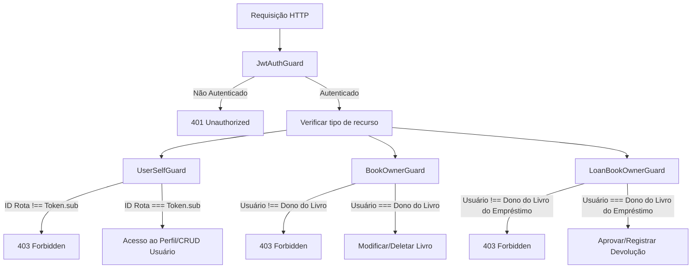

# Arquitetura do Sistema — BOOKSHARE

O BOOKSHARE foi projetado seguindo os princípios de *Clean Architecture*, Injeção de Dependências e desenvolvimento orientado a testes (TDD). A estrutura do projeto é modularizada no ecossistema **NestJS**, o que garante a separação clara de responsabilidades e alta testabilidade.

---

## 1. Organização dos Módulos (Domínios)

A aplicação segue uma estrutura focada em domínios sob a pasta `src/modules/`:

* **`AuthModule`**: Gerencia login, verificação de credenciais, geração de tokens JWT e provisão de Guards de acesso.
* **`UsersModule`**: Gerencia os registros de usuários (CRUD), encriptação de senhas no cadastro e a composição de dados do perfil expandido.
* **`BooksModule`**: Gerencia o acervo de livros disponíveis para compartilhamento.
* **`LoansModule`**: Controla as transações de empréstimo (solicitação, aprovação, devolução, multas e cálculo dinâmico de reputação).

---

## 2. Camadas Arquiteturais e Responsabilidades

Cada módulo é composto por subcamadas com limites bem definidos:

### A. Controllers (Exposição de Rota e HTTP)
Responsável por interceptar requisições HTTP, mapear parâmetros de rota/body, invocar validações básicas de payload (via DTOs e `class-validator`) e direcionar a chamada para a camada de Serviços.
* **Isolamento HTTP**: Os controllers dependem de Guards para realizar a segurança de acesso e utilizam o decorator customizado `@CurrentUser` para extrair os metadados do token JWT de forma transparente, mantendo a assinatura dos métodos limpa.

### B. Services (Regras de Negócio e Casos de Uso)
Onde reside a lógica central da aplicação.
* **Regras de Negócio Estritas**: O Service valida condições e regras (como auto-empréstimo, limites de livros, e redução de reputação por atraso).
* **Tratamento de Exceções**: Em vez de lançar exceções diretamente acopladas ao protocolo HTTP, o domínio dispara exceções de negócio customizadas (ex: `DuplicateEmailException`, `UserLowReputationException`), mantendo a camada de negócio desacoplada de detalhes de infraestrutura HTTP.

### C. Repositories (Interface vs Implementação)
Para isolar a camada de domínio dos detalhes de frameworks ORM (TypeORM) ou bancos de dados específicos (PostgreSQL):
1. **Interface do Repositório (Contrato)**: Define quais operações de banco de dados estão disponíveis para o domínio (ex: `UsersRepository` com `findByEmail`).
2. **Implementação do Repositório (Infraestrutura)**: Implementa as operações usando o TypeORM (ex: `UsersTypeOrmRepository`).
3. **Injeção via Custom Tokens**: A injeção é configurada no módulo correspondente mapeando um Token de injeção (ex: `USERS_REPOSITORY`) para a classe de infraestrutura. Isso permite mockar os repositórios em testes unitários sem dificuldades.

---

## 3. Infraestrutura de Criptografia e Segurança

### A. Abstração de Hash (`HashProvider`)
Para evitar acoplamento direto com algoritmos específicos de hashing no domínio de usuários:
* Foi definida a interface `HashProvider` (`src/modules/users/providers/hash-provider.interface.ts`).
* Foi criada a implementação concreta `BCryptHashProvider` (`src/modules/users/providers/bcrypt-hash-provider.ts`) utilizando o algoritmo `bcrypt` para gerar hashes de senhas seguros com salt.
* O provedor é injetado no `UsersService` através do token `HASH_PROVIDER`.

### B. Módulo de Autenticação JWT
* Utiliza `@nestjs/jwt` configurado com chaves secretas e tempo de expiração para assinar e validar tokens.
* O `AuthService` realiza a validação de login comparando o hash do banco com a senha fornecida na requisição via `HashProvider`, retornando o token Bearer.

---

## 4. Sistema de Guards de Autorização (Authorization Guards)

A segurança de acessibilidade das rotas é dividida em Guards específicos e combináveis:

* **`JwtAuthGuard`**: Executa a validação as síncrona do Bearer Token e injeta o payload decodificado em `request.user`.
* **`UserSelfGuard`**: Compara o ID nos parâmetros da URL com o `sub` do token contido na requisição.
* **`BookOwnerGuard`**: Consulta o livro no banco antes de prosseguir e verifica se o `donoId` coincide com o usuário requisitante.
* **`LoanBookOwnerGuard`**: Consulta o empréstimo e seu livro associado, garantindo que o usuário que executa a aprovação ou confirma a devolução seja de fato o dono daquele exemplar físico.

---

## 5. Garantia de Atomicidade (Transações)

Para operações complexas que alteram múltiplos registros (como o `registerReturnTransaction` na devolução do empréstimo), o sistema utiliza o `QueryRunner` do TypeORM para encapsular as escritas em tabelas distintas (`loans`, `books` e `users`) em uma transação do banco. Isso previne inconsistência de dados em caso de falhas parciais.
